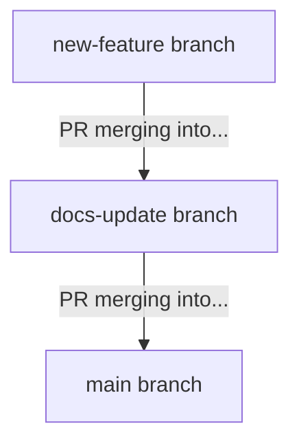

I would love to share an update on [a new project](https://github.com/levibostian/decaf) that I started late last year, and have been having a ton of fun developing. Enjoy! 

> Note: This post is a progress update to a project. I [suggest you read the intro post](/posts/new-deployment-tool/) to get some context on the project.

## It has a name!... decaf

If you read my last post, you’ll remember the placeholder name: “new deployment tool.” Well, I’m excited to share the project finally has a real name...**decaf**. Why **decaf**? There’s a meme in the developer community about going and making a cup of coffee while you deploy your code because it can take a bit of time to perform. The idea behind decaf is that after you merge your pull request, you just move onto your next task while the deployment happens for you in the background. So, sorry, *no more coffee breaks to deploy your code* (this is actually the slogan of decaf). 

## Progress in Alpha: Experimentation, Features, and Calm Deployments

Since the last post, I’ve made 11 deployments of decaf (current version as of today is `1.0.0-alpha.13`). The alpha stage has been a full of experimentation, bug fixes, and deciding on design patterns. Here are some notable changes since the last blog post: 

- **The tool started out only supporting GitHub Actions, but now it can run on any CI server.** 
 
This feature was made possible from the great [semantic-release env-ci](https://github.com/semantic-release/env-ci) module. I got a good laugh and smile when I found out who the author of that module is since [I decided to build this tool based on some frustrations using that particular tool](https://github.com/levibostian/decaf#why-create-this-tool) but it also shows that I have a lot of love and respect for that tool. If it wasn't for that tool, I probably wouldn’t have started this project and found my passion for building deployment tools.

- **decaf is now a compiled binary**

One of the requirements for decaf is that it needs to be reliable today, a month from now, a year from now. The problem with other automated deployment tools is that they might stop working tomorrow, even if you do not make a single change to your code or configuration. This is mostly due to the build system and dependencies. Since I decided to build decaf with [Deno](https://deno.land/), I can easily remove this risk by generating a compiled binary that contains all my code and all of the dependencies. As long as your OS continues to run a compiled version of decaf, then it will run. Today, tomorrow, maybe even years from now. Ahhhhh, that feels good to say that. 

- **Improvements to simulated deployments (aka: test mode)**

Another requirement of decaf is that no one should be nervous about clicking the merge button on a pull request in fear they will break or fail a deployment. There are a couple of ways that decaf helps prevent this, but probably the biggest way is by it's simulated deployment (aka: test mode) that runs by default when you open a pull request. Test mode was shipped by the time I wrote my last blog post but now it supports all three GitHub merge strategies: merge commit, squash, and rebase. So no matter what mode your team uses, you will be able to see exactly what will happen when you merge that pull request. 

- **Support for stacked pull requests**

Simulated deployments now supports *stacked pull requests*. Here’s diagram and example to illustrate why this matters:

Why it's important for decaf to support stacked pull requests is because when you merge these 2 pull requests into `main`, all of the code in the 2 branches will be shipped together (assuming `new-feature` should trigger a deployment). By itself, the `docs-update` branch may not trigger an update but because the `new-feature` pull request will be merged into it, the `docs-update` pull request will indeed trigger a deployment. decaf tries to make this clear by showing you the result of merging the entire stack, not just the individual pull requests. 

- **All behavior is configured by the user**

I have had a difficult time deciding between decaf having default behavior or requiring all behavior to be configured by the user. While default behavior for a tool like this can be helpful to get you up and running quickly, it can also cause confusion and unexpected behavior. After experimentation and multiple design changes, I decided upon requiring all behavior to be configured. If you want semantic versioning, you write the code for it. If you want to use conventional commits, you implement that yourself. decaf doesn’t do anything if you run it without configuration. I want users to feel in control and know exactly what’s going on. Bonus: I think the configuration code for your project can be a type of documentation for your deployment process.

## Using decaf 

I use decaf for its own deployments. So I've been using it for 8 months now. There have been moments where the tool caught bugs for me. Moments where it found flaws in my deployment process that I configured. Moments where I realized it was missing functionality. From all this experience (and the 5 years experience using other tools) I’m starting to collect best practices for different languages and frameworks, so others can benefit from what I’ve learned the hard way. I hope to share these alongside this project as it matures.

A pleasant surprise I was not expecting is how fast decaf is. Running decaf takes less then one second. Much better experience then when using other tools. 

# Next: Get to Beta

We’re still in alpha but getting to beta is the next step. I only have a few tasks to complete before we get there: 
1. Improve the test mode logs so you get more useful details at the pull request level (like which commits are included in the next deployment). 
2. Make configuring the tool easier, especially for common patterns like semantic versioning. Some boilerplate code should be handled by decaf, so users can focus on what matters. 
3. Reviewing the public API for consistency and polish. I plan on not making breaking changes once beta hits, so I want to make sure the API is solid before we get there.

I have had a great time working on decaf. I hope you consider trying it out on a project of yours. I would love to hear from you if you do! 
